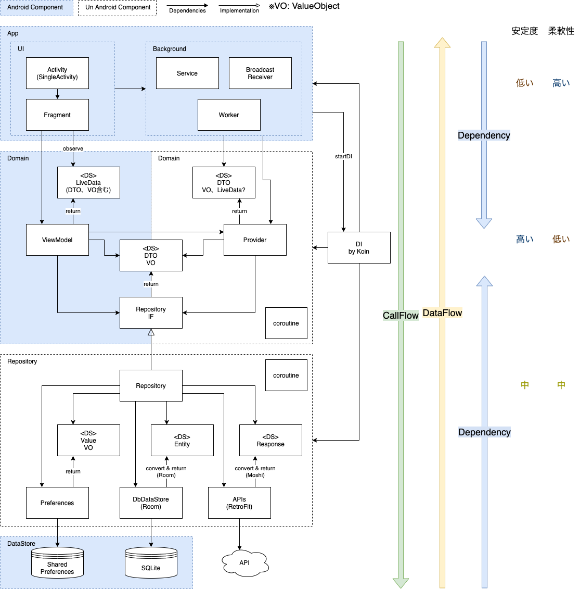

# MvvmMultiModuleArchitecture

## アーキテクチャサンプルの概要

CleanArchitecture の考え方を一部取り入れた MVVM です。  
以下に、どのようにして上図のようになったかを解説します。

## アーキテクチャの方針

目指すところとしては、変更しやすいアーキテクチャを目指したいので、変更に特化した考え方の Clean Architecture を参考に考えます。

CleanArchitectureの基本的な考え方の1つである「関心事の分離」により、コンポーネント間、レイヤー間を切り離しを容易にすることで、柔軟性を上げます。
関心事の分離の観点は以下の５つで

- フレームワーク非依存：システムをフレームワークに縛るのではなく、フレームワークをツールとして使う。
- テスト可能：ビジネスロジックはUI、DB、外部IFなどがなくてもテストできる。
- UI非依存：UIはシステムの他の部分を変更せずとも簡単に変更できる。（例えばビジネスロジック）
- データベース非依存：例えばOracleをMySQLに簡単に置き換えることができる。
- 外部エージェント非依存：ビジネスロジックは外部IFの世界を知らなくて良い。

これらを実現するために

- ソースコードの依存性は上位レベルの方針にだけ向かっていなければならない

と言っています。  
最上位レイヤーは本質的な価値を持つ部分で、書籍ではビジネスモデルで相当すると言われています。
この考え方をベースに、上位レベルのレイヤーは、アプリの価値を提供する部分として「ドメイン」と呼びたいと思います。
（このネーミングが良いかは検討）

また、このアーキテクチャはクライアント・サーバーモデルを前提にしています。

では何をドメインレイヤーにするか？

アプリ内の処理の流れを大きくレイヤー分けすると、以下のように分けることができます。

1. ビュー：UI。アクティビティやフラグメント、ビューなど。
2. プレゼンテーションロジック：入力チェックや表示項目のフォーマットなど。
3. ビジネスロジック：アプリにおけるビジネスロジック。アプリで利用するデータの加工やアプリ独自の機能のロジックなど。
4. データアクセス：アプリ独自の項目を持つDBへのアクセスや、サーバーのエンティティに紐づくデータを持つDBへのアクセス、サーバーへのアクセスなど。
5. データストア：SharedPreferencesやSQLiteなどのデータストア。

この中からドメインを決定したいと思いますが、結論から言いますと全体的なバランスを考慮して、プレゼンテーションロジック、ビジネスロジックのレイヤーをドメインとしたいと思います。

### 検討事項：データストア層のエンティティをドメインにしない理由

アプリのビジネスルールは一見、データモデルとなるエンティティ（データストアの）になりそうです。
しかし、クライアント（アプリ）・サーバー（API）を前提に考えると、サービス自体がサーバーありきで成り立つアーキテクチャであるため、実質、多くのエンティティはサーバーに依存していることになり、エンティティはアプリではコントロールしづらく安定度を高くできない可能性があります。
これを踏まえると、愚直にデータストア付近のエンティティをドメインとするのはためらわれます。
（そもそもサーバーをモデルとしているので、）

### 検討事項：ビューをドメインにしない理由

また、アプリの特徴としてUIのためのロジックを担うことが多いです。
ビュー周りは一般的に変更頻度が高いためテストコード改修も高くなる可能性があり、ここもドメインにするにはためらわれます。

残りのプレゼンテーションロジック、ビジネスロジックを見てみると、これらはビューとデータと切り離すことができるためテスト容易性が高くできます。
また、機能自体もアプリの本質的な価値と言えるためこれらをドメインとして、安定度も高い状態にしていきたいと思います。

### ５つの観点に関する各レイヤーの評価

|レイヤー|FW非依存|テスト可能|UI非依存|DB非依存|外部エージェント非依存|
| ----- | ----- | ----- | ----- | ----- | ----- |
|ビュー|☓。Androidに依存|☓。テストが難しい（変更頻度が多い、時間がかかる）|☓。UIそのもの。|○。非依存|○。非依存|
|PRロジック|☓。LiveData、ViewModelなどがAndroidに依存|○。ロジックが切り離されているためテストしやすい|△。UIとの距離が近いので変更が多い可能性あり|○。非依存|○。非依存|
|ビジネスロジック|△。LiveData、ViewModelを使う場合はAndroidに依存|○。非依存|○。非依存|○。非依存|○。非依存|
|データアクセス|☓。RoomやPreferences、RetroFitなど依存|○。FWに依存するところが多いので難易度が高い可能性あり|○。非依存|☓。データストアに依存したコードを書く必要がある|☓。API関連に依存するクラスは依存|
|データストア|☓。SQLiteやPreferencesそのもの|☓。テストが難しい|○。非依存|☓。データストアそのもの|☓。サーバーのエンティティに依存する可能性あり|

## アーキテクチャの詳細：ベースはMVVMとする

ベースとするGUIアーキテクチャは開発効率と参画敷居を考慮して Android JetPack と親和性の高いMVVMにする。
一部 CleanArchitecture の考え方を適用させます。
レイヤー分けとその特徴としては以下のようにします。

1. ビュー・バックグラウンド
   1. Activityはシングルアクティビティ。アプリのフロントバックのハンドリングとフラグメント管理を行う。Activityを1つにすることでActivityバックスタックの仕様とActivity起動モードを意識しなくてよくするため。ActivityとFragmentは両方ともUIコントローラという側面があるので、UIはFragmentが持つという方針にすることで、Activityとの役割を明確になり、開発の迷いをなくすため。
   1. 1画面1Fragment。画面遷移はNavigationComponent。
   1. DataBindingは使わない。レイアウトファイルにはViewModelを依存させないため。データのオブザーブはフラグメントで行う。
1. ドメイン（ビジネスロジック・プレゼンテーションロジック）
   1. 基本的にビジネスロジック・プレゼンテーションロジックはViewModelが持つ。
   1. このレイヤーで使うDTO、VOが実質このアプリのエンティティの位置付けとなる。VOはValueObjectのことで通常のIntなどの値をクラスにラップすることで、可読性向上、型制約により引数を扱いやすくする、仕様を隠蔽しやすい、などの利点を持つ。
   1. データのやり取りはLiveDataを使う。Fragment、Activityとのやり取りが、ライフサイクル仕様を考慮して安全に連結できるため。可能であればRxは使わない。LiveDataとの使い分けがわかりにくいため。ObservableField系もデータバインディングを使わないので、実質使わない。
   1. Serviceなどのバックグラウンドからのビジネスロジック処理はProviderというクラスを作り、そこにアクセスする。ViewModelに統一しようかと悩んだが、バックグラウンドはViewではないので。また、ネーミングもUseCaseにしようかと考えたが、基本がMVVMなのでCleanArchitectureと混同するとわかりにくくなるかと思い、Providerというネーミングにした。(FlutterではProviderというのがあるので、それを参考にネーミングしました。)
   1. リポジトリレイヤーに依存しないために、RepositoryIFを作りRepositoryレイヤーのクラスはこれを実装する。このあたりがCleanArchitectureの要素で、継承することで依存関係逆転させて「ドメイン（上位レイヤー）に対してのみ依存の方向を向ける」をしています。
1. リポジトリ（データアクセス）
   1. API、データストア、PreferenceへのアクセスをRepositoryパターンを使ってアクセスする。

## ユニットテスト対象

ドメインレイヤーとRepositoryレイヤーをユニットテスト対象とし、ビューレイヤーは変更頻度の高さとテスト難易度を考慮して対象としません。

ドメインレイヤーとRepositoryレイヤーもすべてを対象とするわけではなく、効果の高いところのみを対象とします。